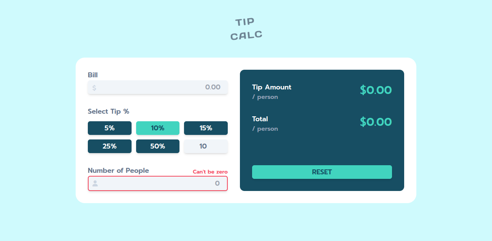

# Frontend Mentor - Tip Calculator App Solution

This is a solution to the [Tip calculator app challenge on Frontend Mentor](https://www.frontendmentor.io/challenges/tip-calculator-app-ugJNGbJUX). Frontend Mentor challenges help you improve your coding skills by building realistic projects.

## Table of contents

- [Frontend Mentor - Tip Calculator App Solution](#frontend-mentor---tip-calculator-app-solution)
  - [Table of contents](#table-of-contents)
  - [Overview](#overview)
    - [The challenge](#the-challenge)
    - [Screenshot](#screenshot)
    - [Links](#links)
  - [My process](#my-process)
    - [Built with](#built-with)
    - [What I learned](#what-i-learned)
    - [Continued development](#continued-development)
  - [Author](#author)

## Overview

### The challenge

Users should be able to:

- View the optimal layout for the app depending on their device's screen size
- See hover states for all interactive elements on the page
- Calculate the correct tip and total cost of the bill per person

### Screenshot



### Links

- Solution URL: [https://github.com/superschooler/tip-calculator](https://github.com/superschooler/tip-calculator)
- Live Site URL: [https://superschooler.github.io/tip-calculator/](https://superschooler.github.io/tip-calculator/)

## My process

### Built with

- Semantic HTML5 markup
- CSS custom properties
- Flexbox
- CSS Grid
- Mobile-first workflow
- [Tailwind CSS](https://tailwindcss.com/) - CSS Framework

### What I learned

This was an awesome project - there was a lot more JavaScript involved than I initially thought there would be due to all of the event listeners and changing styles. This was my first JavaScript project in over a year so it was great to get my feet wet again. It took me around 9 or 10 hours to complete this project, but I had fun with the styling, added some animations when buttons are selected, and chose my own fonts.

Some items caught me up for quite some time. For example, I didn't realize that having a function with parentheses at the end inside of an event listener function would cause the code to immediately execute upon the page loading.

```js
tip5.addEventListener("click", activeButton5());
```

Additionally, I probably wrote significantly more lines of JavaScript than needed because I wasn't sure how to loop through the buttons to reset them all, so I wrote code to reset them one by one. I plan to come back at a later date to revisit my JavaScript code and clean it up. For now, I'm very happy with it because everything works just fine.

Lastly, I used a _TON_ of Tailwind CSS in this project. I didn't want to go through the trouble of installing Tailwind CSS for this project so I could customize colors, so I went with their preset colors and made this project my own. My styles.css sheet ended up to only be 9 lines long!

```css
body {
  font-size: 1.5em;
  min-height: 100vh;
  font-family: "Prompt", sans-serif;
}

h1 {
  font-family: "Days One", sans-serif;
}
```

In the future, I'll use a bit less Tailwind CSS and more vanilla CSS for things like the buttons so I don't have to clutter my HTML file. This would also help clean up my JavaScript file because I wouldn't have to add and remove so many class names to style or reset the buttons.

### Continued development

I plan to continue learning JavaScript to gain proficiency. Additionally, I need to find a balance between vanilla CSS and Tailwind CSS, but I love Tailwind as a framework.

## Author

- Website - [Brian Schooler](https://www.brianschooler.com)
- Frontend Mentor - [@superschooler](https://www.frontendmentor.io/profile/superschooler)
- Twitter - [@superschooler](https://www.twitter.com/yourusername)- Website - [Brian Schooler](https://www.brianschooler.com)
- Frontend Mentor - [@superschooler](https://www.frontendmentor.io/profile/superschooler)
- Twitter - [@superschooler](https://twitter.com/SuperSchooler)
- GitHub - [@superschooler](https://github.com/superschooler)
